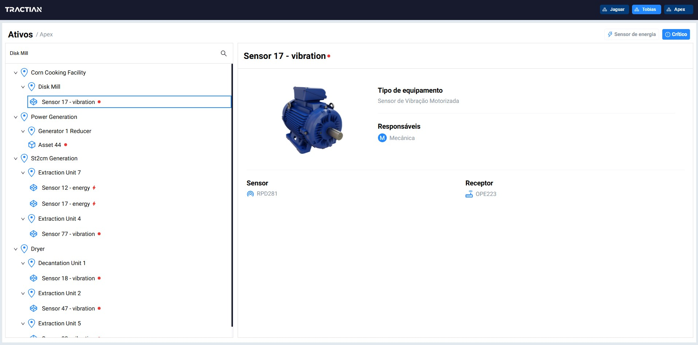

## Development and technologies

The technologies used:

- [Valtio](https://valtio.dev/docs/introduction/getting-started)
  - Valtio was used to manage the state in a simple, efficient and reactive way. Valtio is a state management library that makes it easy to create observable states in JavaScript, allowing any changes in state to be automatically reflected in the user interface without the need for additional manipulations.
- [React query (Tanstack query)](https://tanstack.com/query/v3/):
  - React query was used to cache the API results, optimizing performance by preventing unnecessary refetching, ensuring clean asynchronous data management.
- [Next.js](https://nextjs.org/)
  - Next.js was chosen for its superior route performance, utilizing the [App route](https://nextjs.org/docs/app/building-your-application/routing) architecture. The directory structure inside /app represents each page/route in the project, providing efficient page routing, pushing, and parameter management.

## What would I do differently with more time?

- Implementing query parameters to enhance the usability of the filters, allowing users to easily share, save, and revisit filtered views.

- Establishing test coverage for the project’s files and core functionalities.

- Introducing pagination for trees with a large number of nodes would streamline processing.

- Implementing virtualization to improve performance by rendering only the items visible in the interface, reducing the load on the application and ensuring smoother interactions as users navigate the tree view.

## Results

### Tree without filter and/or asset's selection


### Tree with input filter and selected item



### Tree with energy sensor type selected filter


### Tree with alert status selected filter


### Responsive layout when using in mobile


## Running the project

To run the app, follow these steps:

- First, clone the repository

```bash
git clone git@github.com:baastos/tree-assets.git
```

- After clonning the project, open it on VSCode or another code editor. Then, open the project and install dependencies

```bash
npm install
```

- Run the project

```bash
npm run dev
```

- Now, access the link on you terminal, or just try accessing `http://localhost:3000`.
